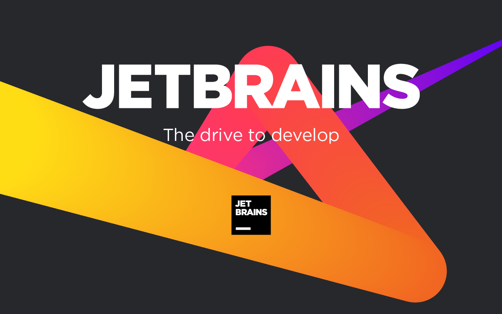

## 快速入门

- [目录](introduction/README.md)

## 工程化

### 构建

- [基础开发配置](engineering/base_config.md)
- [命令工具必知必会](engineering/command.md)
- [交叉编译](engineering/compiling_cross_platform.md)
- [条件编译](engineering/conditional_compilation.md)
- [upx 优化编译文件体积](engineering/upx.md)

### 测试

- [单元测试必知必会](engineering/test.md)
- [单元测试覆盖率](engineering/test_cover.md)
- [单元测试基境](engineering/test_fixture.md)
- [基准测试数据分析](engineering/benchstat.md)
- [模糊测试-理论](engineering/test_fuzzing_theory.md)
- [模糊测试-实践](engineering/test_fuzzing_practice.md)
- [压力测试](engineering/test_performance.md)

### 实践

- [结构体使用技巧](engineering/struct.md)
- [切片使用技巧](engineering/slice.md)
- [JSON 使用技巧](engineering/json.md)
- [embed 嵌入文件](engineering/embed.md)
- [expvar 监控接口状态](engineering/expvar.md)
- [Go 的面向对象编程](engineering/oop_in_go.md)
- [如何实现 implements](engineering/implements.md)
- [数据竞态](engineering/data_race.md)
- [错误处理最佳实践](engineering/error_handle_gracefully.md)

## 陷阱

- [数组和切片参数传递差异](traps/array_with_map_in_params.md)
- [byte 加减](traps/byte_operation.md)
- [map](traps/map_struct_assign.md)
- [copy 复制失败](traps/copy.md)
- [缓冲区内容不输出](traps/buffer_flush.md)
- [切片占用过多内存](traps/slice_occupy_memory.md)
- [实现 String 方法陷入无限递归](traps/string_method.md)
- [错误处理三剑客](traps/defer_with_recover.md)
- [几个有趣的 defer 笔试题](traps/defer_exam.md)
- [nil != nil ?](traps/nil_with_nil.md)
- [nil 作为参数引发的问题](traps/nil_argument.md)
- [for 循环赋值错误](traps/for_assign.md)
- [for 循环调用函数](traps/for_func.md)
- [for 循环 goroutine 执行顺序不一致](traps/for_goroutine.md)
- [interface 方法调用规则](traps/interface_method.md)
- [interface{} != *interface{} ?](traps/interface_error.md)
- [goroutine 竞态](traps/goroutine_race.md)
- [goroutine 泄漏](traps/channel_not_closed.md)

## 微信

## JetBrains open source certificate support

This project has always been developed in the GoLand integrated development environment under JetBrains, based on the **free JetBrains Open Source license(s)** genuine free license. I would like to express my gratitude.

