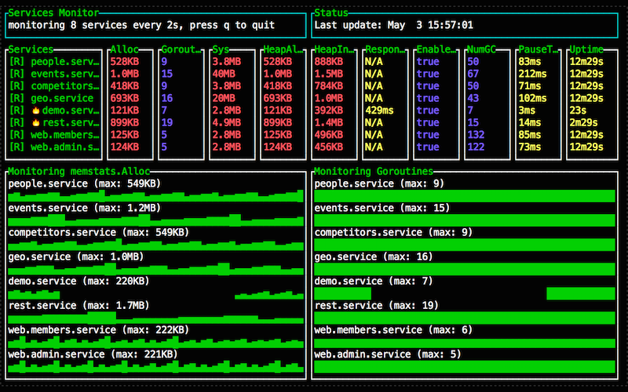

# 概述

`expvar` 包为公共变量提供了一个标准化的接口，如服务接口中的访问计数器。
包提供了 HTTP 接口并以 JSON 格式输出这些变量，接口的 URL 路由是 `/debug/vars` 。

**最重要的是，操作这些公共变量是原子的，这意味着我们不需要考虑并发带来的问题。**

# 例子

## 接口状态码计数器

```go
package main

import (
	"expvar"
	"fmt"
	"log"
	"math/rand"
	"net/http"
	"time"
)

var (
	ok          = expvar.NewInt("200") // 200 计算器
	notFound    = expvar.NewInt("404") // 404 计数器
	serverError = expvar.NewInt("500") // 500 计数器
)

func helloWorld(w http.ResponseWriter, r *http.Request) {
	_, err := fmt.Fprintf(w, "hello world")
	if err != nil {
		log.Fatal(err)
	}

	ok.Add(1) // 增加 200 计数器
}

// 为了模拟 404, 500 错误
// 随机返回 Http Code [200, 404, 500]
func random(w http.ResponseWriter, r *http.Request) {
	rand.Seed(time.Now().UnixNano())
	n := rand.Intn(3)
	var code int

	switch n {
	case 0:
		code = http.StatusOK
		ok.Add(1) // 增加 200 计数器
	case 1:
		code = http.StatusNotFound
		notFound.Add(1) // 增加 404 计数器
	case 2:
		code = http.StatusInternalServerError
		serverError.Add(1) // 增加 500 计数器
	}

	w.WriteHeader(code)
}

func main() {
	http.HandleFunc("/", helloWorld)   // 默认返回地址
	http.HandleFunc("/random", random) // 随机返回状态码地址

	log.Fatal(http.ListenAndServe(":8080", nil))
}
```

## 代码简要说明

- 首先使用 `expvar` 包初始化了 3 个计数器变量
- 接下来定义了两个 HTTP 路由回调方法
    - helloWorld() 负责处理默认路由 `/`
    - random() 负责处理随机返回状态码路由 `/` (主要用这个来做测试)
- 最后，分别设置了路由的回调方法，并且监听端口 `8080`

## 访问 URL 增加计数器的值

### 访问默认地址

```shell
访问: http://localhost:8080/
正常情况下页面刷出 "hello world"
```

### 访问回调地址

```shell
访问: http://localhost:8080/random
正常情况下页面刷出 [200, 404, 500] 中的一个
```

### 重复访问回调地址

```shell
不断刷新页面，访问: http://localhost:8080/random
```

## 查看统计结果

```shell
访问 expvar 包内置的 URL: http://localhost:8080/debug/vars
{
  "200": 15,  // 200 计算器
  "404": 3,   // 404 计算器
  "500": 7,   // 500 计算器
  ...
  ...
  "memstats" {  // 内存值
      ...
      ...
  }
  ...
```

可以看到，输出结果最上面的 3 行就是 3 个计数器变量。`memstats` 包表示的是内存相关信息， 感兴趣的读者可以查看 `runtime.MemStats` 文档。

# 小结

这一小节介绍了 `expvar` 包的作用以及特性，并且用一个 `接口监控` 的例子作为演示。
读者可以在这个基础上继续开发，比如增加 `IP 计数器` `URL 计数器` 等功能，想要深入的读者，可以看看这个开源项目。

[expvarmon](https://github.com/divan/expvarmon)

