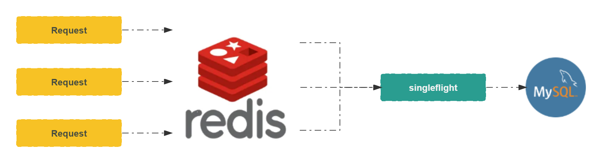

# 概述

**Go 语言扩展包中提供了另一种同步原语 `singleflight`，它能够抑制对某个 API 的多次重复请求**。

举个简单的例子：使用 `Redis` 缓存数据库数据，当发生 `缓存击穿` 时，请求会全部落到数据库上，轻则影响数据库性能，重则造成数据库直接宕机。
通过 `singleflight` 原语，可以简单有效地解决这个问题，通过限制同一个 `key` 的重复请求，避免请求全部落到数据库，减少性能影响和宕机风险。 



接下来，我们通过基准测试来比较一下使用 `singleflight` 原语和不使用 `singleflight` 原语的性能差异。

# 并发请求未限制

测试代码如下:

```go
package performance

import (
	"sync"
	"testing"
	"time"
)

type user struct {
	id       int
	name     string
	password string
	email    string
	token    string
}

func getUserByID(id int) user {
	// 模拟数据库查询耗时
	time.Sleep(time.Millisecond)
	return user{}
}

func BenchmarkBufferWithPool(b *testing.B) {
	var wg sync.WaitGroup

	for n := 0; n < b.N; n++ {
		wg.Add(1)
		go func() {
			defer wg.Done()
			_ = getUserByID(1024)
		}()
	}

	wg.Wait()
}
```

运行测试，并将基准测试结果写入文件:

```shell
# 运行 1000 次，统计内存分配
$ go test -run='^$' -bench=. -count=1 -benchtime=1000x -benchmem > slow.txt
```

# 并发请求限制

测试代码如下:

```go
package performance

import (
	"golang.org/x/sync/singleflight"
	"strconv"
	"sync"
	"testing"
	"time"
)

type user struct {
	id       int
	name     string
	password string
	email    string
	token    string
}

// 使用 singleflight 原语进行并发限制
func getUserByID(sg *singleflight.Group, id int) user {
	// 使用 id 作为 key
	v, _, _ := sg.Do(strconv.Itoa(id), func() (interface{}, error) {
		// 模拟数据库查询耗时
		time.Sleep(time.Millisecond)
		return user{}, nil
	})
	return v.(user)
}

func BenchmarkBufferWithPool(b *testing.B) {
	var wg sync.WaitGroup
	var sg singleflight.Group

	for n := 0; n < b.N; n++ {
		wg.Add(1)
		go func() {
			defer wg.Done()
			_ = getUserByID(&sg, 1024)
		}()
	}

	wg.Wait()
}
```

运行测试，并将基准测试结果写入文件:

```shell
# 运行 1000 次，统计内存分配
$ go test -run='^$' -bench=. -count=1 -benchtime=1000x -benchmem > fast.txt
```

# 使用 benchstat 比较差异

```shell
$ benchstat -alpha=100 fast.txt slow.txt 

# 输出如下:
name              old time/op    new time/op    delta
BufferWithPool-8    1.28µs ± 0%    2.42µs ± 0%  +89.08%  (p=1.000 n=1+1)

name              old alloc/op   new alloc/op   delta
BufferWithPool-8      567B ± 0%      514B ± 0%   -9.35%  (p=1.000 n=1+1)

name              old allocs/op  new allocs/op  delta
BufferWithPool-8      4.00 ± 0%      2.00 ± 0%  -50.00%  (p=1.000 n=1+1)
```

从输出的结果中可以看到，使用 `singleflight` 之后，性能有了很大提升 (虽然 `singleflight` 主要不是用来提升性能的)，
但是同时因为 `缓存数据`, `数据类型转换` 原因，内存的使用量和分配次数也有一定的增加。

# 注意事项

## 一个 goroutine 阻塞，其他 goroutine 全部等待

比较常见的业务场景是直接使用 `singleflight.Do` 方法，这在极端情况下可能会导致参与竞争的 `goroutine` 全部阻塞。
例如从数据库读取数据并写入缓存中这个场景，如果 `singleflight.Do` 方法内部调用的函数因为某种原因阻塞住了，那么会导致所有等待缓存数据的 `goroutine` 全部阻塞。

示例代码如下:

```go
func singleFlightGetNumber(sg *singleflight.Group) int {
	v, _, _ := sg.Do("getNumber", func() (interface{}, error) {
        select {} // 模拟 bug
		return getNumber(), nil
	})
	return v.(int)
}
```

可以使用 `singleflight.DoChan` 方法结合 `select` 做超时控制

```go
func singleFlightGetNumber(sg *singleflight.Group) int {
    v := sg.DoChan("getNumber", func() (interface{}, error) {
        select {} // 模拟 bug
        return getNumber(), nil
    })
	
    select {
    case r := <-v:
        return r.Val.(int)
    case <-time.After(time.Second * 3): // 也可以传入一个含 超时的 context，返回超时错误
        return 0
    }
}
```

# 小结

> 深入理解 singleflight 同步原语之后再使用。

# 扩展阅读

- [singleflight](https://pkg.go.dev/golang.org/x/sync/singleflight)
- [sync.singleflight 到底怎么用？](https://www.cyningsun.com/01-11-2021/golang-concurrency-singleflight.html) 