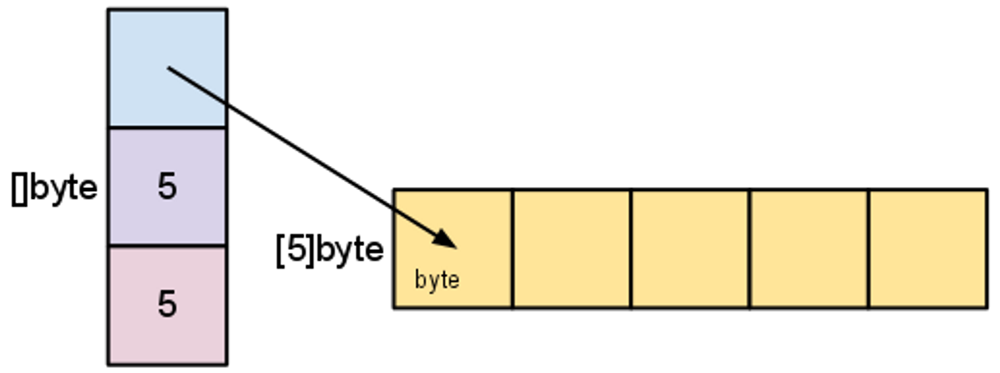
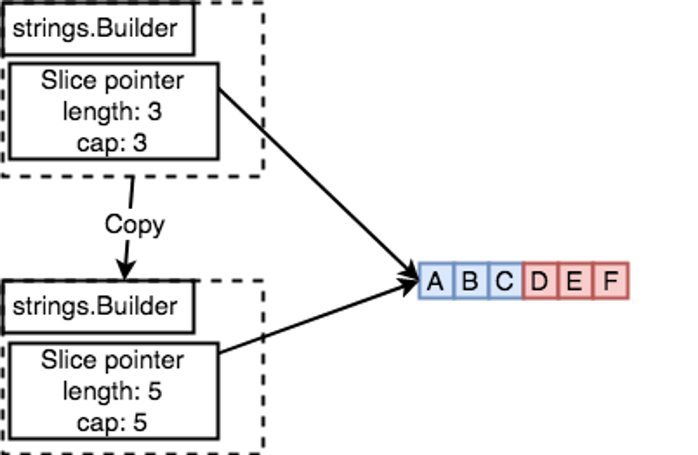

# 概述

Go 的字符串是不可变的，除非用一个新字符串覆盖掉旧字符串。同样，直接拼接两个字符串，等于创建了一个新的字符串。
对于 `字符串拼接` 的场景，不同方法可以会造成 `上千倍` 的性能差距。

下面将围绕常见的字符串拼接方法展开介绍，并进行对应的基准测试和测试结果比较，最终确认不同的方法之间的性能差距以及适用场景。

## 4 种常用方法

- 连接符 `+`
- bytes.Buffer
- strings.Builder
- []byte

# 连接符 和 bytes.Buffer

## 连接符号 `+`

```go
package performance

import (
	"testing"
)

func Benchmark_StringConcat(b *testing.B) {
	s := ""

	for n := 0; n < b.N; n++ {
		s += "hello world"
	}

	s = ""
}
```

运行测试，并将基准测试结果写入文件:

```shell
# 运行 10000 次，统计内存分配
$ go test -run='^$' -bench=. -count=1 -benchtime=10000x -benchmem > plus.txt
```

## bytes.Buffer

```go
package performance

import (
	"bytes"
	"testing"
)

func Benchmark_StringConcat(b *testing.B) {
	var buf bytes.Buffer
	for i := 0; i < b.N; i++ {
		buf.WriteString("hello world")
	}
	_ = buf.String()
}

```

运行测试，并将基准测试结果写入文件:

```shell
# 运行 10000 次，统计内存分配
$ go test -run='^$' -bench=. -count=1 -benchtime=10000x -benchmem > bytebuffer.txt
```

## 比较 + 和 bytes.Buffer 差异

```shell
$ benchstat -alpha=100 bytebuffer.txt plus.txt 

# 输出如下:
name             old time/op    new time/op    delta
_StringConcat-8    18.2ns ± 0%  8519.0ns ± 0%   +46579.45%  (p=1.000 n=1+1)

name             old alloc/op   new alloc/op   delta
_StringConcat-8     26.0B ± 0%  58217.0B ± 0%  +223811.54%  (p=1.000 n=1+1)

name             old allocs/op  new allocs/op  delta
_StringConcat-8      0.00           1.00 ± 0%        +Inf%  (p=1.000 n=1+1)
```

输出的结果分为了三行，分别对应基准测试期间的: 运行时间、内存分配总量、内存分配次数，可以看到:

- 运行时间: `+` 是 `bytes.Buffer` 的好几百倍
- 内存分配总量: `+` 是 `bytes.Buffer` 的好几千倍

因为时间关系，基准测试只运行了 10000 次，运行次数越大，优化的效果越明显。感兴趣的读者可以将 `-benchtime` 调大后看看优化效果。

## 性能分析

当使用连接符 `+` 拼接两个字符串时，会生成一个新的字符串并开辟新的内存空间，空间大小等于两个字符串之和。
刚才的基准测试中，循环不断拼接新的字符串，这样就会不断申请内存空间，以此类推，性能就会越来越差。
**在字符串密集拼接场景中，使用 `+` 会严重降低性能**。

# bytes.Buffer 和 strings.Builder

## strings.Builder

```go
package performance

import (
	"strings"
	"testing"
)

func Benchmark_StringConcat(b *testing.B) {
	var sb strings.Builder
	for i := 0; i < b.N; i++ {
		sb.WriteString("hello world")
	}
	_ = sb.String()
}
```

运行测试，并将基准测试结果写入文件:

```shell
# 运行 10000 次，统计内存分配
$ go test -run='^$' -bench=. -count=1 -benchtime=10000x -benchmem > stringsbuilder.txt
```

## 比较 strings.Builder 和 bytes.Buffer 差异

```shell
$ benchstat -alpha=100 stringsbuilder.txt bytebuffer.txt

# 输出如下
name             old time/op    new time/op    delta
_StringConcat-8    11.3ns ± 0%    13.6ns ± 0%  +19.88%  (p=1.000 n=1+1)

name             old alloc/op   new alloc/op   delta
_StringConcat-8     52.0B ± 0%     53.0B ± 0%   +1.92%  (p=1.000 n=1+1)

name             old allocs/op  new allocs/op  delta
_StringConcat-8      0.00           0.00          ~     (all equal)
```

从输出结果中可以看到，两者内存分配差不多，性能方面，`strings.Builder` 比 `bytes.Buffer` 快差不多 `20%`。

## 性能分析

`strings.Builder` 和 `bytes.Buffer` 底层都是一个 `[]byte`，但是 `bytes.Buffer` 转换字符串时重新申请了内存空间用来存放，
而 `strings.Builder` 直接将底层的 `[]byte` 转换为字符串返回。

## 方法内部实现

### bytes.Buffer

```go
// String returns the contents of the unread portion of the buffer
// as a string. If the Buffer is a nil pointer, it returns "<nil>".
//
// To build strings more efficiently, see the strings.Builder type.
func (b *Buffer) String() string {
    if b == nil {
        // Special case, useful in debugging.
        return "<nil>"
    }
    return string(b.buf[b.off:])
}
```

### strings.Buffer

```go
// String returns the accumulated string.
func (b *Builder) String() string {
    return *(*string)(unsafe.Pointer(&b.buf))
}
```

另外，bytes.Buffer 的源代码中写到:

> To build strings more efficiently, see the strings.Builder type. (构建字符串更高效的方法是 strings.Builder)

# strings.Builder 和预分配 []byte

```go
package performance

import (
	"testing"
)

func Benchmark_StringConcat(b *testing.B) {
	str := "hello world"
	buf := make([]byte, 0, b.N*len(str))

	for i := 0; i < b.N; i++ {
		buf = append(buf, str...)
	}
	_ = string(buf)
}
```

运行测试，并将基准测试结果写入文件:

```shell
# 运行 10000 次，统计内存分配
$ go test -run='^$' -bench=. -count=1 -benchtime=10000x -benchmem > prealloc.txt
```

## 比较 strings.Builder 和 预分配 []byte 差异

```shell
$ benchstat -alpha=100 prealloc.txt stringsbuilder.txt
name             old time/op    new time/op    delta
_StringConcat-8    5.20ns ± 0%   11.32ns ± 0%  +117.69%  (p=1.000 n=1+1)

name             old alloc/op   new alloc/op   delta
_StringConcat-8     22.0B ± 0%     52.0B ± 0%  +136.36%  (p=1.000 n=1+1)

name             old allocs/op  new allocs/op  delta
_StringConcat-8      0.00           0.00           ~     (all equal)
```

从输出结果中可以看到，性能方面，`预分配` 比 `strings.Builder` 快 `1.2 倍`，内存分配方面，`预分配` 比 `strings.Builder`
节省 `1.4 倍`。

## 性能分析

`strings.Builder` 的底层依赖于一个 `[]byte`, 所以随着方法 `WriteString` 的不断写入，肯定会引起扩容，这也是性能方面逊色于 `预分配` 的原因。

# 预分配 strings.Builder 和预分配 []byte

`strings.Builder` 也有对应的预分配容量方法，接下来，我们先对 `strings.Builder` 进行预分配，再进行基准测试。

## Grow

`strings.Builder` 有一个方法 `Grow` 用来进行扩容，可以先将容量扩增到指定数量，然后进行基准测试。

```go
package performance

import (
	"strings"
	"testing"
)

func Benchmark_StringConcat(b *testing.B) {
	str := "hello world"

	var sb strings.Builder
	sb.Grow(b.N * len(str))

	for i := 0; i < b.N; i++ {
		sb.WriteString(str)
	}
	_ = sb.String()
}
```

运行测试，并将基准测试结果写入文件:

```shell
# 运行 10000 次，统计内存分配
$ go test -run='^$' -bench=. -count=1 -benchtime=10000x -benchmem > stringsbuilder_grow.txt
```

## 比较 预分配 strings.Builder 和预分配 []byte 的差异

```shell
$ benchstat -alpha=100  prealloc.txt stringsbuilder_grow.txt

# 输出如下
name             old time/op    new time/op    delta
_StringConcat-8    5.20ns ± 0%    4.32ns ± 0%  -16.92%  (p=1.000 n=1+1)

name             old alloc/op   new alloc/op   delta
_StringConcat-8     22.0B ± 0%     11.0B ± 0%  -50.00%  (p=1.000 n=1+1)

name             old allocs/op  new allocs/op  delta
_StringConcat-8      0.00           0.00          ~     (all equal)
```

从输出结果中可以看到，性能方面，`strings.Builder + Grow 预分配` 比 `预分配 []byte` 快 `17%`，
内存分配方面，`strings.Builder + Grow 预分配` 比 `预分配 []byte` 节省 `50%`。

## 性能分析

`strings.Builder` 进行预分配后，内部操作就和 `预分配 []byte` 基本一致了，最终输出字符串时，
`strings.Builder` 的 `String` 方法没有 `byte` 和 `string` 的相互转换，这也是性能方面强于 `预分配 []byte` 的原因。

# strings.Builder 备忘录

## strings.Builder 禁止 copy

拷贝一个 `strings.Builder` 并写入的时候，会发生 `panic`。

```go
package main

import (
	"strings"
)

func main() {
	var sb strings.Builder
	sb.WriteString("hello")
	sb2 := sb
	sb2.WriteString("world")
}
```

```shell
$ go run main.go

panic: strings: illegal use of non-zero Builder copied by value

goroutine 1 [running]:
...
...
exit status 2
```

### 原因分析



`strings.Builder` 通过一个指针指向实际保存数据的底层数组，拷贝 `strings.Builder` 时同时也拷贝了它的的指针，
但是 `拷贝过来的指针` 仍然指向之前的底层数组 (等于两者共享了一个底层数组)
，如果此时写入数据，那么被拷贝的 `strings.Builder` 也会受到影响。



# 小结

本小节循序渐进地介绍了常用的字符串拼接方法，并进行了一系列的基准测试和测试结果比较，下面是笔者总结的不同场景下的字符串使用实践。

## 使用场景:

- 简单的字符串拼接用 `+` 即可
- 格式化字符串使用 `fmt.Sprintf`
- `[]byte` 直接使用 `bytes.Buffer`, 尽量使用方法 `Grow` 预分配一定的空间，可以更好地提升性能
- `字符串` 直接使用 `strings.Builder`, 尽量使用方法 `Grow` 预分配一定的空间，可以更好地提升性能
- 常用字符串定义为常量，这样可以将其创建在 `只读空间`，并且可以被全局复用
- 选择合理的数据类型，尽量避免 `[]byte` 和 `string` 互相转换
- 尽量不要使用 `字符串指针`，因为会导致数据逃逸到堆上 (传递的是指针的拷贝，如果发生扩容的话，必然会逃逸)， 增加 `GC` 开销

## 注意事项:

> bytes.Buffer 和 strings.Builder 非并发安全。
