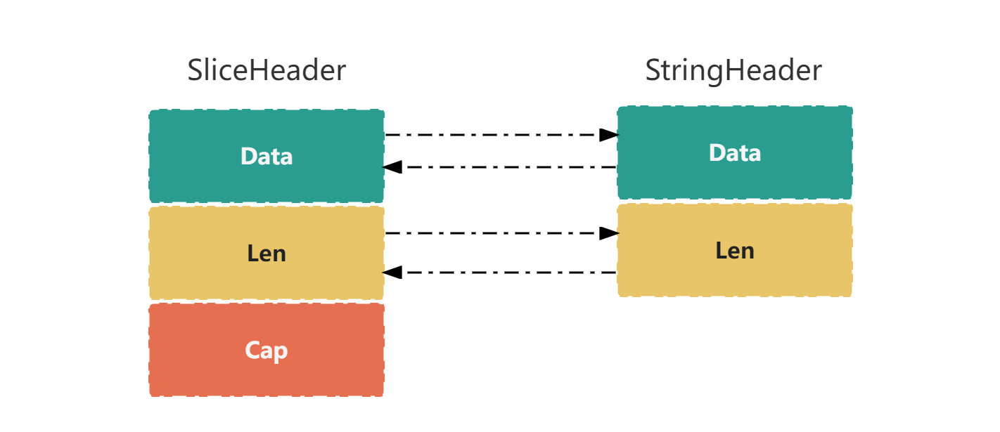

# 概述

`字符串` 与 `字符切片` 互相转换，是开发中经常用到的功能，但是你能想到，一个简单的优化，就可以提高 `10 倍+` 性能吗？

# []byte 转换为 string

## 普通方法

测试代码如下:

```go
package performance

import (
	"testing"
)

func b2s(b []byte) string {
	return string(b)
}

func Benchmark_StringWithBytes(b *testing.B) {
	bs := []byte(`hello world`)

	for i := 0; i < b.N; i++ {
		_ = b2s(bs)
	}
}
```

运行测试，并将基准测试结果写入文件:

```shell
$ go test -run='^$' -bench=. -count=1 -benchtime=10000000x > slow.txt
```

## 优化版本

测试代码如下:

```go
package performance

import (
	"testing"
	"unsafe"
)

func b2s(b []byte) string {
	return *(*string)(unsafe.Pointer(&b))
}

func Benchmark_StringWithBytes(b *testing.B) {
	bs := []byte(`hello world`)

	for i := 0; i < b.N; i++ {
		_ = b2s(bs)
	}
}
```

运行测试，并将基准测试结果写入文件:

```shell
$ go test -run='^$' -bench=. -count=1 -benchtime=10000000x > fast.txt
```

## 使用 benchstat 比较差异

```shell
$ benchstat -alpha=100 fast.txt slow.txt 

# 输出如下
name                old time/op  new time/op  delta
_StringWithBytes-8  0.27ns ± 0%  3.66ns ± 0%  +1234.67%  (p=1.000 n=1+1)
```

从输出结果中可以看到，性能方面，`优化版本方法` 比 `普通方法` 快 `12 倍` 还多。

# string 转换为 []byte

## 普通方法

测试代码如下:

```go
package performance

import (
	"testing"
)

func s2b(s string) []byte {
	return []byte(s)
}

func Benchmark_StringWithBytes(b *testing.B) {
	s := "hello world"

	for i := 0; i < b.N; i++ {
		_ = s2b(s)
	}
}
```

运行测试，并将基准测试结果写入文件:

```shell
$ go test -run='^$' -bench=. -count=1 -benchtime=10000000x > slow.txt
```

## 优化版本

测试代码如下:

```go
package performance

import (
	"reflect"
	"testing"
	"unsafe"
)

func s2b(s string) (b []byte) {
	bh := (*reflect.SliceHeader)(unsafe.Pointer(&b))
	sh := (*reflect.StringHeader)(unsafe.Pointer(&s))
	bh.Data = sh.Data
	bh.Cap = sh.Len
	bh.Len = sh.Len
	return b
}

func Benchmark_StringWithBytes(b *testing.B) {
	s := "hello world"

	for i := 0; i < b.N; i++ {
		_ = s2b(s)
	}
}
```

运行测试，并将基准测试结果写入文件:

```shell
$ go test -run='^$' -bench=. -count=1 -benchtime=10000000x > fast.txt
```

## 使用 benchstat 比较差异

```shell
$ benchstat -alpha=100 fast.txt slow.txt 

# 输出如下
name                old time/op  new time/op  delta
_StringWithBytes-8  0.28ns ± 0%  4.26ns ± 0%  +1422.50%  (p=1.000 n=1+1)
```

从输出结果中可以看到，性能方面，`优化版本方法` 比 `普通方法` 快 `14 倍` 还多。

# 优化原理

首先，我们来看一下字符串和切片的 `运行时` 底层数据结构。

## 字符串数据结构

```go
type StringHeader struct {
	Data uintptr
	Len  int
}
```

## 切片数据结构

```go
type SliceHeader struct {
	Data uintptr
	Len  int
	Cap  int
}
```



## 两者比较

通过对比，我们可以看到，`切片` 结构只比 `字符串` 结构多了一个 `Cap` 字段，其他字段和顺序都相同， 所以可以直接通过 `指针互换` 的方式来实现两者的互相转换。

# 小结

本小节主要介绍了 `字符串和 []byte` 互相转换的 `普通方法` 和 `优化方法`，并进行了对应的基准测试和测试结果比较，
`优化方法` 后的方法可以提升高达 `十几倍` 的性能，其实在主流的很多框架源代码中，这两个 `优化方法` 的身影随处可见。
读者可以将这两个方法集成到自己的项目中，试试性能能否提升。
